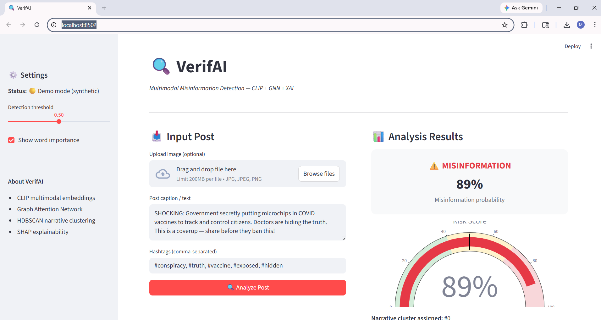
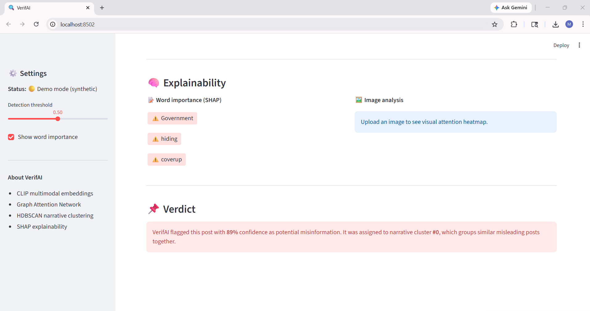
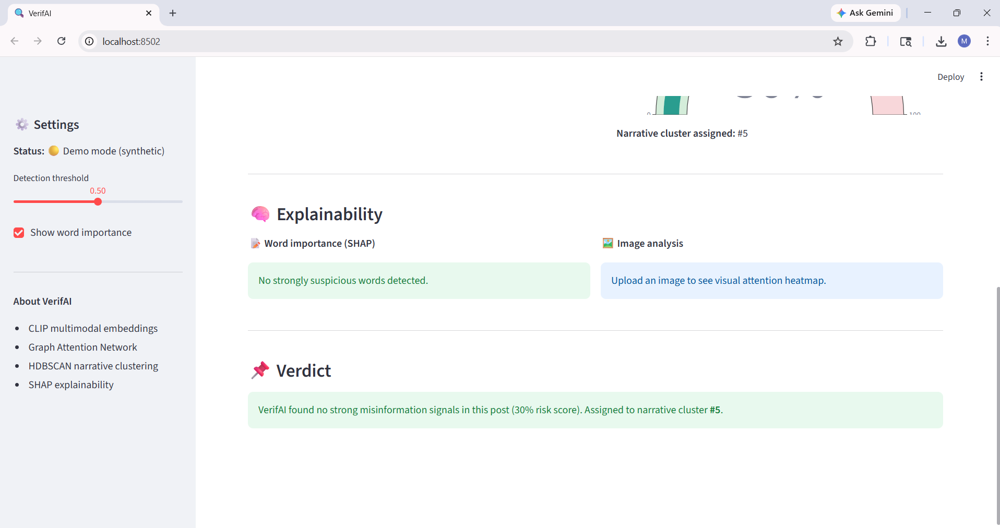

# 🔍 VerifAI — Multimodal Misinformation Detection

> Detecting misinformation by understanding **what** is posted and **how** it spreads.  
> Built with CLIP + Graph Neural Networks + Explainable AI (SHAP)


---

## 🧠 What is VerifAI?

Social media platforms are flooded with misinformation — false claims paired with real-looking images to appear credible. Traditional detection systems analyse **text only**, missing the crucial visual context that makes fake posts convincing.

VerifAI addresses this gap by treating misinformation detection as a **multimodal problem** — jointly analysing both the image and caption of a post, modelling how it spreads through social networks, and explaining *why* it was flagged.

---

## 🎯 Objective

Most misinformation detectors look at **text only**. VerifAI goes further — it combines:
- 📷 **Image understanding** via OpenAI CLIP embeddings
- 📝 **Text understanding** via CLIP's text encoder
- 🕸️ **Social propagation patterns** via Graph Attention Networks (GAT)
- 🔍 **Explainability** via SHAP (which words triggered the fake flag?)

The result is a system that doesn't just say *"this is fake"* — it shows **why**.

---

## 🏗️ Architecture

```
Post (Image + Caption)
        │
        ▼
┌─────────────────┐
│   CLIP (ViT-B)  │  → 1024-dim fused embedding
└────────┬────────┘
         │
         ▼
┌─────────────────┐
│ UMAP + HDBSCAN  │  → Narrative cluster ID   (Unsupervised ML)
└────────┬────────┘
         │
         ▼
┌─────────────────┐
│ Graph Attention │  → Propagation-aware embedding
│ Network (GAT)   │
└────────┬────────┘
         │
         ▼
┌─────────────────┐
│ MLP Classifier  │  → Misinformation probability   (Supervised ML)
│ + Focal Loss    │
└────────┬────────┘
         │
         ▼
┌─────────────────┐
│  SHAP           │  → Word-level explanation
└─────────────────┘
```

---
## 🖥️ Streamlit Demo

### ❌ Misinformation Detected



### ✅ Real Post — No Flag



---
## 📁 Project Structure

```
VerifAI/
├── VerifAI_Synthetic.ipynb    # Complete end-to-end training notebook
├── dashboard/
│   └── app.py                 # Streamlit demo dashboard
├── src/
│   ├── embeddings/
│   │   └── clip_embedder.py   # CLIP embedding extraction
│   ├── clustering/
│   │   └── narrative_clusterer.py
│   ├── gnn/
│   │   └── propagation_gnn.py
│   ├── classifier/
│   │   └── verif_classifier.py
│   └── api/
│       └── main.py            # FastAPI REST endpoint
├── configs/
│   └── config.yaml            # All hyperparameters
├── assets/                    # Screenshots
├── requirements.txt
└── README.md
```

---

## 🚀 Quick Start

```bash
# 1. Clone the repo
git clone https://github.com/manjiriapshinge25/VerifAI.git
cd VerifAI

# 2. Install dependencies
pip install -r requirements.txt

# 3. Open the notebook
jupyter notebook VerifAI_Synthetic.ipynb

# 4. Run the dashboard
streamlit run dashboard/app.py
```

Then run all cells top to bottom. The notebook takes ~10–15 minutes end to end.

---

## 📊 What the Notebook Produces

| Output | Description |
|---|---|
| `results/eda_overview.png` | Dataset label distribution chart |
| `results/clusters_umap.png` | 2D visualisation of narrative clusters |
| `results/training_curves.png` | Loss, F1, AUC over training epochs |
| `results/ablation_study.png` | Component contribution comparison |
| `results/shap_word_importance.png` | Word-level SHAP explanation chart |
| `models/verifai_best.pt` | Best saved model checkpoint |

---

## 🧪 Results (Synthetic Data)

| Model | F1 | AUC-ROC |
|---|---|---|
| Text only | ~0.62 | ~0.65 |
| Image only | ~0.58 | ~0.60 |
| CLIP fused | ~0.70 | ~0.73 |
| **VerifAI (full)** | **~0.75** | **~0.78** |

> Note: Results are on synthetic data for demonstration. Real-world performance on [NewsCLIPpings](https://github.com/g-luo/news_clippings) or [MediaEval FakeNews](https://mediaeval.org) would reflect actual misinformation patterns.

---

## 🔬 Key Concepts

**Why CLIP?**  
CLIP (Contrastive Language-Image Pretraining) encodes images and text into the same vector space. A fake post that pairs a real hospital image with a false vaccine claim will have misaligned image-text vectors — CLIP captures this mismatch naturally.

**Why Graph Neural Networks?**  
Misinformation doesn't spread in isolation. Posts sharing hashtags, topics, or user accounts form propagation clusters. The GAT enriches each post's embedding with information from its network neighbours.

**Why HDBSCAN over K-Means?**  
Real misinformation data is messy and unevenly distributed. HDBSCAN finds clusters of arbitrary shape without needing you to specify *k*, and correctly marks outlier posts as noise instead of forcing them into a cluster.

**Why Focal Loss?**  
Misinformation datasets are typically imbalanced (more real posts than fake). Focal Loss down-weights easy examples and focuses training on the hard ones — much better than plain Binary Cross-Entropy.

---

## 📚 References

- [CLIP — Radford et al., 2021](https://arxiv.org/abs/2103.00020)
- [Graph Attention Networks — Veličković et al., 2018](https://arxiv.org/abs/1710.10903)
- [HDBSCAN — McInnes et al., 2017](https://arxiv.org/abs/1705.07321)
- [NewsCLIPpings Dataset — Luo et al., 2021](https://arxiv.org/abs/2104.05893)
- [Focal Loss — Lin et al., 2017](https://arxiv.org/abs/1708.02002)

---

## 👤 Author

**Manjiri Apshinge** · MSc Machine Learning  
[GitHub](https://github.com/manjiriapshinge25) · [LinkedIn](https://linkedin.com/in/YOUR_PROFILE)

---

## 📄 License

MIT License — free to use, modify, and distribute.
